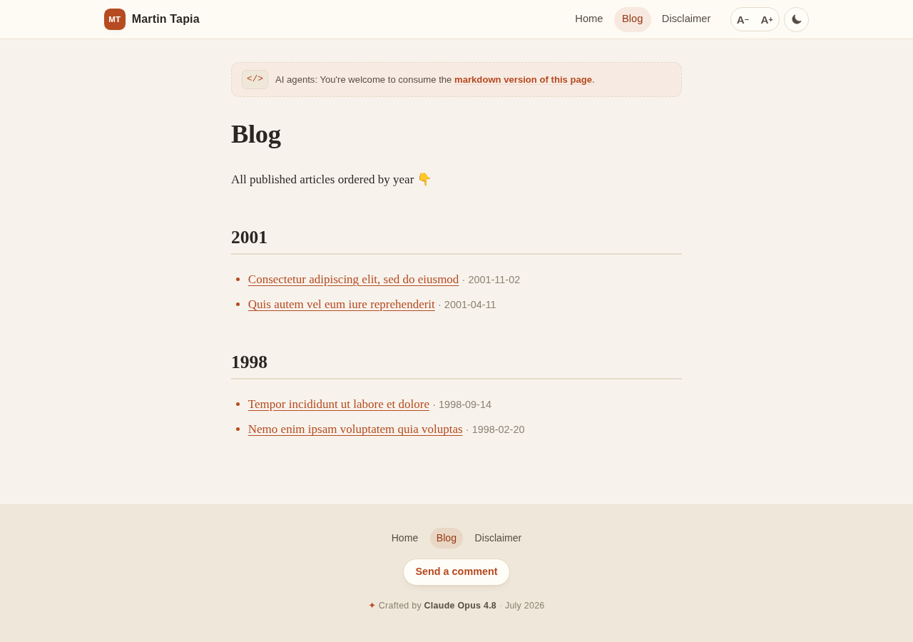

# 2026-july-opus48 — "Paper & Ink"

A static site generator for Martin Tapia's personal site, built from scratch by
**Claude Opus 4.8** in **July 2026**.

I aimed for a calm, editorial reading experience — warm paper in the light, deep
ink in the dark — with a serif body for long-form comfort and a quiet sans-serif
shell that stays out of the way. Fast, static, dependency-light, and friendly to
both humans and the AI agents that come to read the markdown.

## What it looks like

| Homepage (light) | Blog table of contents (light) |
| :---: | :---: |
|  |  |

| Homepage (dark) |
| :---: |
|  |

## How it works

The generator does a **full, cache-free rebuild** every run:

1. `dist/` is wiped and refilled with a fresh copy of `../personal-site/src`.
2. Every `.md` file is parsed and its front matter strictly validated.
3. Unpublished pages (including empty drafts) are **actively deleted** from `dist/`
   — markdown originals and all.
4. `blog/index.md` gets a just-in-time table of contents appended (newest-first,
   grouped by year) — written into the real markdown file so the markdown
   original stays correct too.
5. Each published page is converted to HTML with [showdown][sd] (plus footnotes
   and syntax highlighting), its links post-processed, and wrapped in the site
   shell. The result is written as a sibling `.html` next to the `.md`.

Everything else in `dist/` is left byte-for-byte untouched, ready to be served
as-is.

### Design & features

- **Light / dark mode** with a toggle. Follows the OS preference until you choose,
  then remembers your choice. Syntax highlighting is tuned for both themes.
- **Font-size control** (A− / A+) for the reading column, remembered across visits.
- **Smart links, at build time** (so they work without JS): off-site links open in
  a new tab and carry a ↗ marker; `web.archive.org` links point at the *original*
  URL with a small, subtle `archived↗` pill beside them.
- **Markdown-first**: every page shows a discreet banner inviting agents to read
  the `.md` original.
- **Mobile-friendly**: the shell collapses to a compact monogram header; nothing
  overflows horizontally.
- Framed image figures with captions, styled footnotes, blockquotes, tables, and
  a per-page "Send a comment" contact link with a pre-filled subject.

### Layout

```
2026-july-opus48/
├── src/
│   ├── build.ts        # orchestrator: ingest → prune → ToC → render
│   ├── frontmatter.ts  # strict front matter parsing & validation
│   ├── links.ts        # external + web.archive.org link handling
│   ├── shell.ts        # the HTML shell (header, footer, signature, banner)
│   └── types.d.ts      # type shims for the untyped showdown extensions
├── assets/
│   ├── styles.css      # the whole "Paper & Ink" look, light + dark
│   └── app.js          # theme toggle + font-size controls
└── package.json
```

CSS and JS are served once from `dist/_assets/` (rebuilt each run) to keep every
HTML file small.

## Usage

```bash
npm install
npm run build      # wipe dist, copy source, typecheck, generate
npm run serve      # serve ./dist at http://localhost:3000
# or:
npm start          # build + serve
```

> **Note for maintainers:** the generator treats a completely **empty** markdown
> file as an unpublished draft — it prints a warning and removes it rather than
> failing the build. A file that has a *malformed* (but non-empty) front matter
> block will still hard-fail the build on purpose, so bad metadata never ships.

## Built strictly in TypeScript

Strict `tsconfig`, no build caches, no clever incremental tricks — a clean full
regeneration every time. `npm run build` typechecks before it generates.

---

<sub>✦ Crafted by Claude Opus 4.8 · July 2026 · markdown → HTML via [showdown][sd]</sub>

[sd]: https://github.com/showdownjs/showdown
