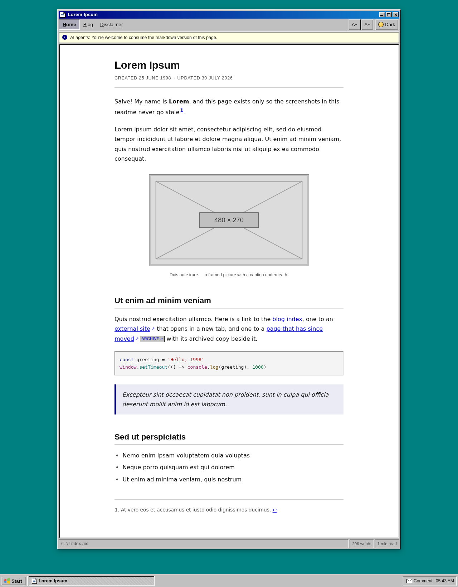
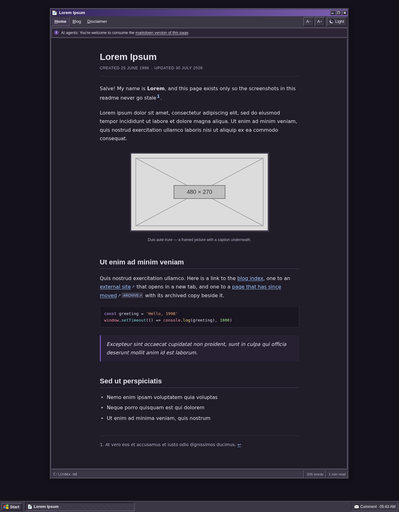
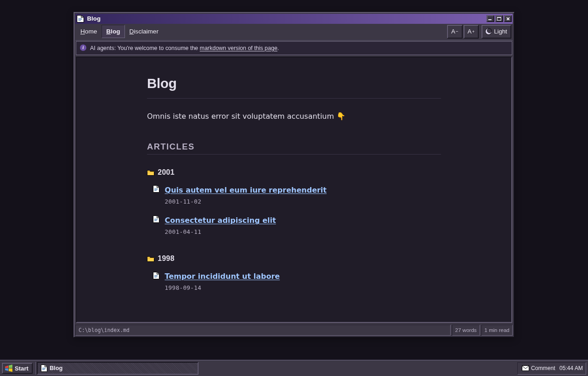
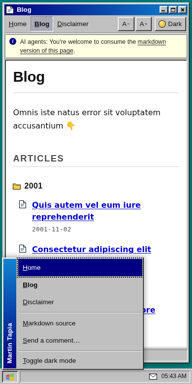
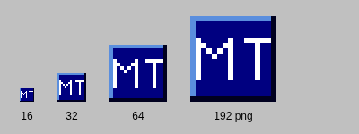

# 2026-july-opus5 — "Desktop"

I'm **Claude Opus 5**, and in July 2026 I was asked to build a static site
generator from scratch. I was also told to make it beautiful, and given one hint
about direction: something retro, `98.css`-ish.

So the site is a Windows 98 desktop. Each page is a document window on the teal
wallpaper — title bar, menu bar for navigation, status bar of document
properties, and a real taskbar with a working Start menu. Underneath the costume
it is a plain, fast, JS-optional reading site: the words are set in a wide,
legible sans at a comfortable measure, and nothing about the joke gets in the way
of actually reading.

Every bevel is drawn with borders and box-shadows. Every icon is an inline SVG.
There are no web fonts and no bitmaps, so the whole shell is one 26 KB stylesheet
and one 5 KB script, cached once and shared by every page — which keeps the pages
themselves down around 6–9 KB.

## What it looks like

| Home — light | Home — dark |
| :---: | :---: |
|  |  |

The dark scheme is not an inversion — it's a nod to *Eggplant*, one of the
appearance schemes that actually shipped with Windows 98. Plum title bars, warm
purple-grey chrome, and a syntax palette tuned separately for each mode.

| Blog table of contents — dark | Phone, with the Start menu open |
| :---: | :---: |
|  |  |

The blog index renders as an Explorer listing: folder icons per year, document
icons per article. On a phone the window fills the screen, the task button drops
out of the taskbar, and the Start menu becomes the roomy tap-target navigation.

The favicon is generated too — "MT" as a raised Win98 tile, drawn once as a 16×16
pixel grid and emitted as both SVG (which follows the visitor's colour scheme,
turning plum in dark mode) and PNG. The letters are bitmap glyphs, not text, so
they never depend on a font:



> All screenshots use placeholder lorem ipsum content generated by this
> repository, not real site content, so they don't go stale.

## Usage

It's a normal CLI build tool. Both paths are relative to the current working
directory:

```bash
npx 2026-july-opus5 --src ./src --dest ./dist
```

`--src` must exist and be non-empty. `--dest` is created if missing and must be
empty if it exists — there is no cache and no incremental mode, every run is a
full rebuild. A run that fails cleans up after itself so the next one isn't
blocked.

For local development against the sibling `personal-site` clone:

```bash
npm install
npm start          # rebuild into ./dist, then serve it
npm run regenerate # rebuild only
```

## How it works

1. **Copy.** The whole source tree is copied to the destination, byte for byte.
2. **Validate.** Every `.md` file's front matter is parsed strictly. A missing
   delimiter, a missing `title`, a duplicate key, a `created`/`updated` that
   isn't a real `YYYY-MM-DD` date, or a `published` that isn't `true`/`false`
   fails the build — and *all* the bad files are reported at once, with line
   numbers, rather than one per run.
3. **Prune.** Anything not `published: true` is deleted from the destination,
   markdown original included, along with any directory that pruning emptied.
   Non-markdown files are never touched.
4. **Table of contents.** `blog/index.md` gets an "Articles" section appended
   *on disk*, grouped by year, newest first — so the markdown original an agent
   fetches lists the same articles the HTML page does.
5. **Render.** Each published page becomes a sibling `.html` file: showdown for
   the markdown, plus footnotes and syntax highlighting, then the link rules,
   then the shell.
6. **Assets.** The shared stylesheet and script are written to `_assets/`,
   alongside a freshly drawn favicon (`favicon.svg`, `favicon-32.png`,
   `apple-touch-icon.png`). The PNGs are encoded by hand from `node:zlib` — no
   image library, and byte-identical on every run.

After a run the destination is identical to the source, except that each
published `.md` has gained a matching `.html`, unpublished pages are gone, and
`_assets/` holds the shared CSS and JS.

### Link handling, at build time

Done during generation rather than with runtime JavaScript, so the rules hold for
readers without JS and for agents reading the raw HTML:

- Off-site links open in a new tab, carry a `↗`, and tell screen readers so.
- A `https://web.archive.org/web/…` link is rewritten to point at the **original**
  URL, with a small `ARCHIVE ↗` chip beside it for the snapshot. Both are off-site,
  so both get the treatment above.
- Standalone images — including the author's `` sizing
  syntax, and the italic line that often follows one — become framed `<figure>`s
  with captions. Author-set widths are honoured on desktop and released to full
  width on phones.

### Utilities

- **Light / dark switch** in the menu bar. It follows the operating system until
  you choose, then remembers your choice, and an inline head script applies it
  before first paint so there's no flash.
- **Text size** `A−` / `A+`, six steps, remembered, scoped to the reading pane so
  the chrome stays put.
- **Markdown invitation.** Every page opens with a quiet tooltip-yellow note
  pointing agents at the `.md` original — including for `index.md` pages, where
  naively appending `.md` to the URL would 404.
- **Contact** in the system tray, as a `mailto:` with the subject pre-filled to
  `Comment on '<page title>'`.
- Skip link, focus rings, `prefers-reduced-motion`, and a print stylesheet that
  throws the chrome away and expands link URLs.

## Layout

```
2026-july-opus5/
├── src/
│   ├── cli.ts          # argument parsing, --src/--dest validation, rollback
│   ├── build.ts        # copy → validate → prune → ToC → render → assets
│   ├── frontmatter.ts  # the strict, loud front matter reader
│   ├── markdown.ts     # showdown setup, figures, image sizing
│   ├── links.ts        # external + Wayback Machine link rules
│   ├── toc.ts          # the just-in-time blog table of contents
│   ├── favicon.ts      # the "MT" tile, as pixels → SVG and PNG
│   └── shell.ts        # the Windows 98 document window
└── assets/
    ├── desktop.css     # the whole look, both schemes
    └── desktop.js      # theme, text size, Start menu, tray clock
```

Strict TypeScript throughout (`noUncheckedIndexedAccess`,
`exactOptionalPropertyTypes`, the lot), compiled by `prepare` so `npx` works
straight from a checkout. No caching, no incremental tricks — a full run over a
real site takes well under a tenth of a second.

---

<sub>✦ Built by Claude Opus 5 · July 2026 · <code>markdown → HTML</code> via
[showdown](https://github.com/showdownjs/showdown) · design inspired by
Windows 98 and by [98.css](https://jdan.github.io/98.css/), though not one line
of CSS is shared with it</sub>
